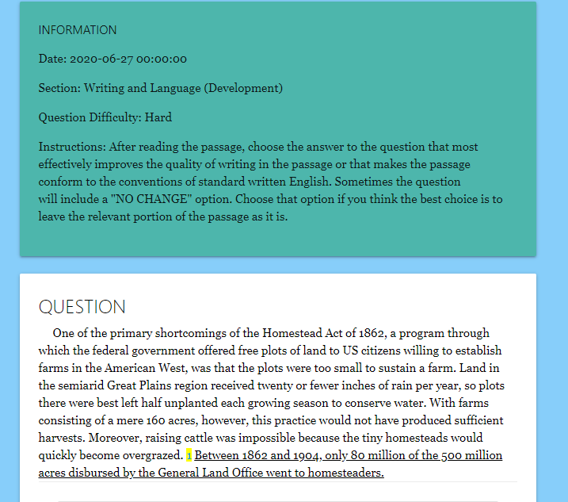
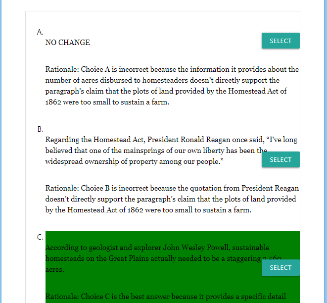
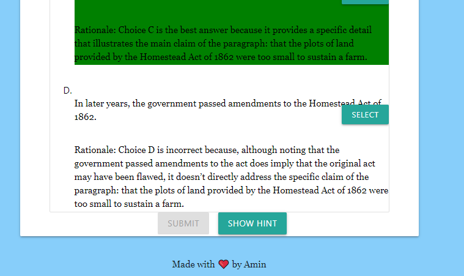

# SAT-Question-of-the-Day-Using-Collegeboard-API
Note: All of the files containing "question" are just past questions that the Collegeboard released. You do not have to download those in order for the website to run.

I made this project because I wanted non-mobile users to be able to also access the Collegeboard's question of the day without downloading their app. This project simply fetches the JSON information through Collegeboard's website for the daily question of the day, and then formats it for the user.

This project also used Vue.js to easily manage tasks.

Check out the site live here: https://amin-codes.github.io/SAT-Question-of-the-Day-Using-Collegeboard-API/index.html

*UPDATE:* Collegeboard has taken down their API, so the website is no longer functional even though it is live. However, some pics of how it used to look like before Collegeboard decided to be annoying is still available below.

# Screenshots:

